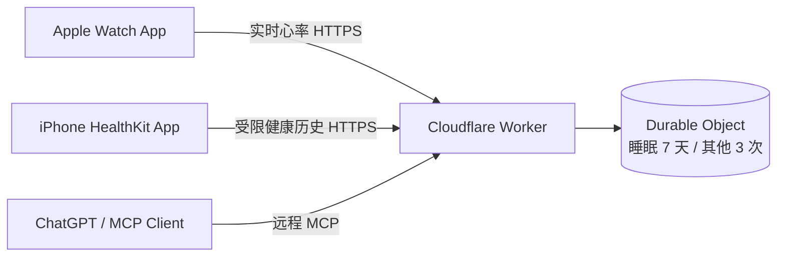

# Apple Watch Health MCP

把用户明确授权的 Apple Health / Apple Watch 数据，通过自托管 Cloudflare Worker 暴露为远程 MCP 工具，让 ChatGPT、Codex 或其他 MCP 客户端读取最新数据和受限历史。

> This project connects user-authorized Apple Health data to an AI assistant through a self-hosted MCP relay.

这是一份可自行部署的实验项目，不是医疗设备，也不提供诊断或治疗建议。

## 能做什么

- iPhone 从 HealthKit 读取心率、静息心率、HRV、血氧、呼吸频率、步数、距离、活动能量、噪音暴露、睡眠等数据。
- Apple Watch 在用户主动开启实时模式后，通过 `HKWorkoutSession` 获取实时心率样本。
- 睡眠保存最近 7 天的阶段片段（在床、清醒、核心、深睡、REM 等），其余指标每项保存最近 3 次采样。
- Cloudflare Worker 自动去重和裁剪历史，并通过四个 MCP 工具返回数据、新鲜度与保留范围。
- 使用两个独立随机令牌保护上传接口和 MCP 地址。
- 用户可以随时调用删除接口清空服务器上的健康快照。

## 重要限制

- MCP **不能远程启动 Apple Watch 传感器**。实时心率必须由用户在手表上打开 App 并点“开始”。
- `watch_measure_now` 只能在实时模式已经运行时等待下一条新心率样本。
- 血氧、噪音、睡眠等指标只能读取 HealthKit 中已有的记录，不能由第三方 App 强制立即测量。
- HealthKit 后台更新由系统调度，不保证零延迟。设备型号、地区、系统版本和用户授权会影响可用指标。
- 保留窗口有意保持很短：睡眠 7 天，其他指标 3 次。本项目不是长期健康档案或医疗数据库。

## 架构



## 目录

- `ios/`: SwiftUI iPhone App、watchOS App 和 Xcode 工程。
- `cloudflare/`: Worker、Durable Object、MCP 接口和自动测试。
- `self-hosted/`: Python alternative backend — no Cloudflare Workers Paid, no Xcode. Uses Health Auto Export app instead of custom iOS app.
- `PRIVACY.md`: 数据流、风险和删除方式。
- `SECURITY.md`: 密钥管理与漏洞报告建议。

## Two deployment options

| | Cloudflare Worker | Self-Hosted Python |
|--|---|---|
| Cost | $5/month (Workers Paid) | $0 |
| iOS app | Custom Swift (Xcode + $99/yr Apple Developer) | Health Auto Export ($3-40, one-time) |
| Real-time heart rate | Yes | No (periodic snapshots) |
| See | [`cloudflare/`](cloudflare/) | [`self-hosted/`](self-hosted/) |

## 1. 部署 Cloudflare Worker

需要 Node.js 20+、Cloudflare 账号和 Wrangler。

```bash
cd cloudflare
npm install
npx wrangler login
```

生成两个不同的随机令牌，并把它们临时保存在密码管理器中：

```bash
openssl rand -hex 32
openssl rand -hex 32
```

分别写入 Worker Secret：

```bash
npx wrangler secret put UPLOAD_TOKEN
npx wrangler secret put MCP_PATH_TOKEN
npm run deploy
```

部署完成后记下 Worker 地址，例如：

```text
https://watch-health-mcp.<your-subdomain>.workers.dev
```

## 2. 配置并安装 Apple App

复制示例配置到两个 target。`RelayConfig.plist` 已加入 `.gitignore`，不要提交它。

```bash
cp ios/Configuration/RelayConfig.example.plist ios/WatchHealthTest/RelayConfig.plist
cp ios/Configuration/RelayConfig.example.plist "ios/WatchHealthLive Watch App/RelayConfig.plist"
```

在两个文件中填写：

- `BaseURL`: 上一步得到的 Worker 地址，不带末尾 `/`。
- `UploadToken`: 写入 Cloudflare 的 `UPLOAD_TOKEN`。

然后：

1. 用 Xcode 打开 `ios/WatchHealthTest.xcodeproj`。
2. 在 iPhone 和 Watch 两个 Targets 的 Signing & Capabilities 中选择自己的 Team。
3. 如果 Bundle Identifier 冲突，把 `com.example.AppleWatchHealthMCP` 改成自己的唯一标识，并保持 Watch App 的 Companion App Identifier 一致。
4. 确认两个 Targets 都启用了 HealthKit。
5. 先运行 iPhone App并授权，再从 Watch App 安装列表安装 `WatchHealthLive`。

没有私密配置文件时，App 仍可本地读取并展示 HealthKit 数据，但不会上传。

## 3. 连接 MCP 客户端

远程 MCP 地址为：

```text
https://watch-health-mcp.<your-subdomain>.workers.dev/mcp/<MCP_PATH_TOKEN>
```

把完整地址添加到支持远程 MCP 的客户端中。这个 URL 本身就是访问健康数据的凭证，禁止截图、分享或提交到 GitHub。

可用工具：

- `watch_health_open_session`: 首先调用，查看连接、实时模式与数据新鲜度。
- `watch_get_latest_health`: 读取所有最新指标、采样时间、数据年龄和历史条数。
- `watch_get_health_history`: 读取睡眠近 7 天的完整阶段，或其他指标最近 3 次采样；可通过 `metric` 参数只查询一项。
- `watch_measure_now`: 实时模式开启时，等待一条请求之后产生的新心率样本。

## 删除云端数据

```bash
curl -X DELETE \
  -H "Authorization: Bearer <UPLOAD_TOKEN>" \
  "https://watch-health-mcp.<your-subdomain>.workers.dev/data"
```

返回 `{"ok":true,"deleted":true}` 后，Durable Object 中的最新数据、受限历史与待处理命令已被清除。

## 开发检查

```bash
cd cloudflare
npm test
npm run check
```

iOS 和 watchOS 工程建议使用 Xcode 16 或更新版本。最低部署目标为 iOS 17 和 watchOS 10。

## License

[MIT](LICENSE)
